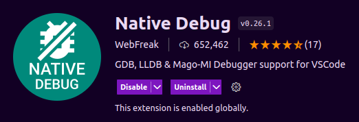

# Отладка на удаленном устройстве.

### Плагины для VSCode.
* Для поддержки отладки необходимо поставить плагин Native Debug.
*https://marketplace.visualstudio.com/items?itemName=webfreak.debug.*


### Скрипт до запуска отладки.
* Перед запуском отладки, необходимо скопировать исполняемые файлы на удаленное устройство. В папке настройки среды *.vscode* создать файл **tasks.json**, прописать в нем конфигурацию скрипт синхронизации папок:
```javascript
{
    "version": "2.0.0",
    "tasks": [
        {
            // Имя задачи.
            "label": "rsync",
            // Исполняемый скрипт.
            "command": "rsync -avzhHl ~/ovision-ml-sdk-rv/build/examples/cpp/bin root@192.168.88.25:/root",
            // Тип скрипта.
            "type": "shell"
        }
    ]
}
```
* где `root` - имя пользователя удаленного устройства, `192.168.88.25` - IP удаленного устройства.

### Скрипт запуска отладки.
* В папке настройки среды *.vscode* создать файл **launch.json**, прописать в нем конфигурацию нативного отладчика gdb:
```javascript
{
    "configurations": [
        {
            // Имя задачи перед запуском отладки. Например, синхронизация исполняемых файлов.
            "preLaunchTask": "rsync",

            "type": "gdb",
            // Вид запуска (старт исполняемого файла).
            "request": "launch",

            "name": "Run",
             // Путь к gdb отладчику на удаленном устройстве(нужно поставить если нет).
            "gdbpath": "/usr/bin/gdb",
            // Имя исполняемого файла.
            "target": "./ovision_ml_sdk_rv_example_tests",
            // Путь к исходнику.
            "cwd": "${workspaceFolder}/examples/cpp/tests/src/main.cpp",
            "valuesFormatting": "parseText",
            "ssh": {
                 // IP адрес удаленного устройства.
                "host": "192.168.88.25",
                 // Путь к исполняемому файлу(имя бинарника возьмется из target).
                "cwd": "/root/bin/",
                // Ключ или пароль к удаленному устройству("password": "pass",).
                "keyfile": "/home/user/.ssh/id_rsa",
                "user": "root"
            }
        }
    ]
}
```

### Скрипты.
* Все скрипты в папке [scripts](/scripts).